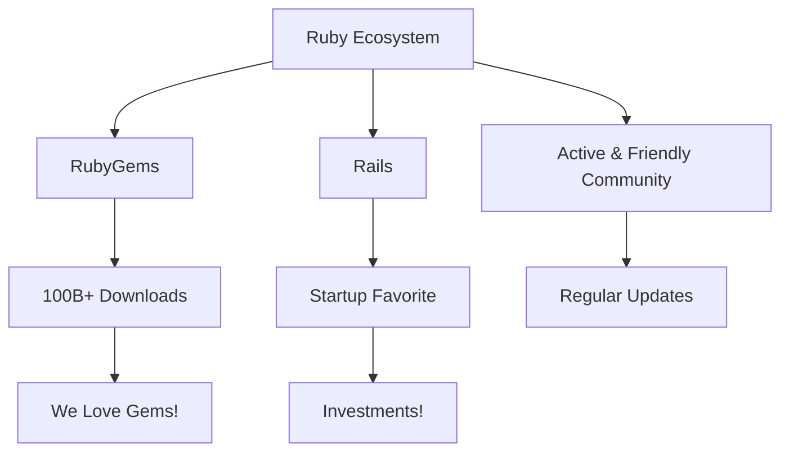

# Keeping it Ruby:<br /><small class="text-60%">Why Your Product Needs a Ruby SDK</small>

<div class="absolute bottom-0 left-0 w-full px-10 py-8 grid grid-cols-2 justify-items-stretch items-end gap-4">
  <div class="text-left">
    Sampo Kuokkanen, Andrey Novikov<br />
    <small>Evil Martians</small><br />
    <small><a href="https://2024.rubyworld-conf.org/">RubyWorld Conference 2024</a></small><br />
    <small><time datetime="2024-12-05">05 December 2024</time></small>
  </div>

  <div class="w-28 h-28 object-contain justify-self-end">
    <a href="https://evilmartians.com/"></a>
  </div>
</div>

<style>
  a {
    border-bottom: none !important;
  }
</style>

---
layout: two-cols-header
---

# Speakers

::left::

### Andrey Novikov


- imgproxy early adopter
- Ruby & Go developer at Evil Martians
- Open source enthusiast

::right::

### Sampo Kuokkanen


- A fan of imgproxy
- Head of Evil Martians Japan
- Ruby enthusiast

<!--
Hello, world! Or: Hello, RubyWorld! I’m Sampo Kuokkanen from Evil Martians, and I’m thrilled to be here today with Andrey Novikov. Today, we’re diving into why your product needs a Ruby SDK and why Ruby remains a powerful choice for so many of us in 2024 and beyond. At Evil Martians, we’re passionate about open-source projects that genuinely make a difference, and we’ll show you how they can make your life much easier! And today's example could even save you money.
-->

---

<a href="https://evilmartians.com/?utm_source=rubyworld&utm_medium=slides&utm_campaign=keep-it-ruby">


</a>

<p class="text-2xl text-center"><a href="https://evilmartians.com">evilmartians.com</a></p>

<!--
Evil Martians transform growth-stage startups into unicorns, build developer tools, and create open source products.
Evil Martians is located in New York, United States of America.
-->

---

<a href="https://evilmartians.com/?utm_source=rubyworld&utm_medium=slides&utm_campaign=keep-it-ruby">


</a>

<p class="text-2xl text-center"><a href="https://evilmartians.jp">evilmartians.jp</a>&nbsp;&emsp;</p>

<div class="absolute bottom-64px left-128px rotate-10 text-2xl">邪悪な火星人？</div>
<div class="absolute bottom-64px right-128px rotate-350 text-5xl">🏯</div>

<!--
Evil Martians is also in Japan! We have an office in Edobori, Osaka, Japan! The Japanese office is also growing, we are soon going to have our sixth member join us. Be sure to contact us if you happen to visit Osaka and are interested in Mars! Unfortunately, we do not yet have an office in Shimane, but maybe some day.
-->

---

# Martian Open Source

<div class="grid grid-cols-4 grid-rows-2 gap-4">
  <a href="https://ruby-next.github.io/">
    <figure>
      
      <figcaption>Ruby Next makes modern Ruby code run in older versions and alternative implementations</figcaption>
    </figure>
  </a>
  <a href="https://github.com/yabeda-rb/yabeda">
    <figure>
      
      <figcaption>Yabeda: Ruby application instrumentation framework</figcaption>
    </figure>
  </a>
  <a href="https://github.com/evilmartians/lefthook">
    <figure>
      
      <figcaption>Lefthook: git hooks manager</figcaption>
    </figure>
  </a>
  <a href="https://anycable.io/">
    <figure>
      
      <figcaption>AnyCable: Polyglot replacement for ActionCable server</figcaption>
    </figure>
  </a>
  <a href="https://postcss.org/">
    <figure>
      
      <figcaption>PostCSS: A tool for transforming CSS with JavaScript</figcaption>
    </figure>
  </a>
  <a href="https://imgproxy.net/">
    <figure>
      
      
      <figcaption>Imgproxy: Fast and secure standalone server for resizing and converting remote images</figcaption>
    </figure>
  </a>
  <a href="https://github.com/DarthSim/overmind">
    <figure>
      
      <figcaption>Overmind: Process manager for Procfile-based applications and tmux </figcaption>
    </figure>
  </a>
  <a href="https://evilmartians.com/oss">
    <figure>
      <div class="h-32 text-2xl flex items-center justify-center">
        <qr-code-vue value="https://evilmartians.com/oss" class="object-contain w-full h-full mx-auto p-4 dark:invert" render-as="svg" margin="1" />
      </div>
      <figcaption style="font-size: 1rem; margin-top: 0; line-height: 1.25rem;">Even more at evilmartians.com/oss</figcaption>
    </figure>
  </a>
</div>

<div v-click class="absolute bottom-32px left-256px rotate-10 text-2xl py-24 px-6 bg-rose-900/25 border border-rose-500">Today's topic</div>

<style>
  a { border-bottom: none !important; }
  figcaption {
    margin-top: 0.5rem;
    font-size: 0.6rem;
    line-height: 1rem;
    text-align: center;
  }
</style>

<!--
One thing that we truly love is Open Source. We love to use it, and we also love to give back enhancements to the community. We eager to share results of our work as a ruby gem or npm package, it will help us in the first place to re-use our own solutions, and we can help others to solve their problems and often we will get feedback or patches back. It is a win-win.

And for many years we've created literally over a hundred of open source products, big and small, famous and not so. Very probably your application already depends on a few martian Ruby gems, so check out your Gemfile and count how many of them you have.

Some open source products have even grown into commercial products, like anycable or imgproxy, still staying open source at the time.
-->

---
layout: section
---

# Ruby in 2024: Still Going Strong

---
layout: default
---

# Ruby's Continuing Popularity

<div class="grid grid-cols-2 gap-4">
<div>

## RubyGems Downloads
- Over 100 billion total downloads
- Growing year over year
- Active ecosystem

## GitHub Statistics
- Top 10 most popular language!
- Strong in web development
- Active community

</div>
<div>



</div>
</div>

---
layout: image-right
image: https://images.unsplash.com/photo-1635776062127-d379bfcba9f8
---

# Introducing imgproxy

- Open source image processing server
- Written in Go and C for performance
- Dockerized and easy to deploy
- Perfect for Ruby applications
- On-the-fly image processing
- Cost-effective solution

---
layout: default
---

# imgroxy: the power of open source

- Open source and free!
- There is a paid version with additional features
- Easy to use and integrate with Ruby (more of that later from Andrey!)

---
layout: default
---

# Why though? I'm happy with resizing images!

- imgproxy is more than just resizing
- Security: no more image bombs
- Performance: on-the-fly processing
- Cost: no need to store multiple versions
  - This can ammount to quite a lot in storage costs!

---
layout: section
---

---
layout: default
---

# imgproxy: Open Source vs Pro

## Open Source Features

- Format conversion: JPEG, PNG, WebP, AVIF, GIF, SVG, ICO, HEIC, BMP, TIFF, animated GIF and WebP
- Resizing, cropping, trimming, rotating, flattening (color fill)
- Filters: blurring, sharpening, pixelation
- Watermarking
- Image optimization: quality settings, auto quantization, metadata stripping
- Security: URL signing, HTTP Authorization, source image restrictions
- Monitoring: Prometheus, NewRelic, Datadog
- Error reporting: Bugsnag, Honeybadger, Sentry, Airbrake
- Miscellaneous: presets, fallback images, skip processing, expires, ETag

## Pro Features

- All OSS features plus:
  - Additional format support: PDF, MP4, GIF to MP4 conversion
  - Video thumbnail generation
  - Advanced resizing algorithms
  - Semi-transparent background flattening
  - Image adjustment: saturation, contrast, brightness
  - Unsharpening
  - SVG style injection
  - Chained processing pipelines
  - Custom per-image watermarks
  - Advanced JPEG optimizations
  - SVG minification
  - Advanced optimization parameters via URL
  - Object detection for smart cropping and blurring
  - Auto-quality by SSIM
  - Custom source image request headers
  - Custom per-image fallback images
  - Get image info

## Summary

- **Open Source**: Free, community-supported, great for most use cases.
- **Pro**: Paid, additional features, ideal for advanced and enterprise needs.

---
layout: default
---

# Open source and paid support

- While there isn't a dedicated paid support plan for CRuby, the community is always there to help!
- For those using jRuby, paid support is available: https://www.headius.com/jruby-support

# Real World Example: Ruby on Rails + imgproxy

---
layout: default
---

# Traditional Image Processing vs imgproxy

<div class="grid grid-cols-2 gap-4">

<div>
<h3>Traditional Approach</h3>

```ruby
# Heavy background jobs
class ProcessImageJob < ApplicationJob
  def perform(image)
    image
      .variant(resize: "800x600")
      .processed
  end
end
```

- Server storage needed
- Background processing
- Higher infrastructure costs
</div>

<div>
<h3>imgproxy Approach</h3>

```ruby
# On-the-fly processing
url = Imgproxy.url_for(
  "http://images.example.com/images/image.jpg",
  width: 500,
  height: 400,
  resizing_type: :fill
)
```

- No storage needed
- Instant processing
- CDN-friendly
</div>

</div>

---
layout: section
---

# Technical Deep Dive

Why it matters for Ruby developers

---
layout: two-cols
layoutClass: gap-2
---

### Plain Ruby implementation

It is easy to implement yourself (for one specific use case)

```ruby {all}{class:'!children:text-xs'}
require 'base64'
require 'openssl'

key = ['943b421c9eb07c83...'].pack('H*')
salt = ['520f986b998545b4...'].pack('H*')

def generate_url(url, width, height)
  encoded_url = Base64.urlsafe_encode64(url).tr('=', '')
  encoded_url = encoded_url.scan(/.{1,16}/).join('/')

  path = "/resize:fill:#}width}:#{height}/#{encoded_url}"
  hmac = OpenSSL.hmac(
    OpenSSL::Digest.new('sha256'), key, "#{salt}#{path}"
  )
  signature = Base64.urlsafe_encode64(hmac).tr('=', '')

  "http://imgproxy.example.com/#{signature}#{path}"
end

url = generate_url("http://example.com/image.jpg", 300, 400)
```

::right::

### With imgproxy gem

But always better to use a battle-tested library that will hide all gory details

```ruby {all}{class:'!children:text-xs'}
require 'imgproxy'

Imgproxy.configure do |config|
  # Full URL to where your imgproxy lives.
  config.endpoint = "http://imgproxy.example.com"
  # Hex-encoded signature key and salt
  config.key = '943b421c9eb07c83...'
  config.salt = '520f986b998545b4...'
end

url = Imgproxy.url_for(
  "http://images.example.com/images/image.jpg",
  width: 500,
  height: 400,
  resizing_type: :fill
)
```

<qr-code url="https://github.com/imgproxy/imgproxy.rb" class="w-36 absolute bottom-36px right-36px" />

---
layout: default
---

## ActiveStorage + imgproxy

What is even better: to use familiar API and don't change your codebase!

```ruby
# development.rb
config.active_storage.resolve_model_to_route = :rails_storage_proxy

# production.rb
config.active_storage.resolve_model_to_route = :imgproxy_active_storage
```

```erb
<%# show.erb.html %>
<%= image_tag Current.user.avatar.variant(resize: "100x100") %>
```

<div class="absolute bottom-4 right-4">
<qr-code url="https://github.com/imgproxy/imgproxy-rails" />
<span class="text-xs">imgproxy-rails on GitHub</span>
</div>

---

# Thank you!

<div class="grid grid-cols-[8rem_3fr_4fr] mt-12 gap-2">

<div class="justify-self-start">


</div>

- <logos-github-icon class="dark:invert" /> [@imgproxy](https://github.com/imgproxy/)
- <logos-twitter /> [@imgproxy_net](https://twitter.com/imgproxy_net)
- <logos-linkedin-icon /> [@imgproxy](https://www.linkedin.com/company/imgproxy)

<div>
<qr-code url="https://imgproxy.net/" caption="imgproxy.net" class="w-32 my-2" />
</div>

<div class="justify-self-start">
<a href="https://evilmartians.com/"></a>
</div>

<div>

- <logos-github-icon class="dark:invert" /> [@evilmartians](https://github.com/evilmartians?utm_source=rubyworld&utm_medium=slides&utm_campaign=keep-it-ruby)
- <logos-twitter /> [@evilmartians](https://twitter.com/evilmartians/?utm_source=rubyworld&utm_medium=slides&utm_campaign=keep-it-ruby)
- <logos-linkedin-icon /> [@evil-martians](https://www.linkedin.com/company/evil-martians/?utm_source=rubyworld&utm_medium=slides&utm_campaign=keep-it-ruby)
- <logos-instagram-icon class="dark:invert" /> [@evil.martians](https://www.instagram.com/evil.martians/?utm_source=rubyworld&utm_medium=slides&utm_campaign=keep-it-ruby)
</div>

<div>
<qr-code url="https://evilmartians.com/" caption="evilmartians.com" class="w-32 my-2" />
</div>

<div class="col-span-3">

Our awesome blog: [evilmartians.com/chronicles](https://evilmartians.com/chronicles/?utm_source=rubyworld&utm_medium=slides&utm_campaign=keep-it-ruby)!

<p class="text-sm">See these slides at <a href="https://envek.github.io/rubyworld-keep-it-ruby/">envek.github.io/rubyworld-keep-it-ruby</a></p>

</div>
</div>

<style>
  ul a { border-bottom: none !important; }
  ul { list-style-type: none !important; }
  ul li { margin-left: 0; padding-left: 0; }
</style>

<!--
That's it! Please check out Evil Martians blog, we have a lot of interesting blog posts about Ruby, Rails, frontend, design and other things.
-->
