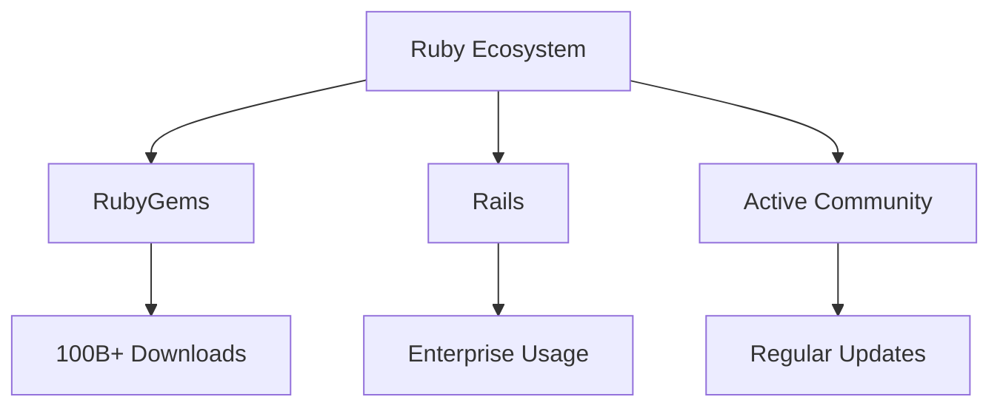

# Keeping it Ruby
## Why Your Product Needs a Ruby SDK

RubyWorld Conference 2024

<div class="pt-12">
  <span class="px-2 py-1">
    Andrey Novikov & Sampo Kuokkanen
  </span>
</div>

---
layout: two-cols
---

# Your Speakers

::left::

### Andrey Novikov


- Core contributor to imgproxy
- Ruby & Go developer
- Open source enthusiast

::right::

### Sampo Kuokkanen


- Developer Advocate at imgproxy
- Ruby community member
- Open source contributor

---
layout: section
---

# Ruby in 2024: Still Going Strong

---
layout: default
---

# Ruby's Continuing Popularity

<div class="grid grid-cols-2 gap-4">
<div>

## RubyGems Downloads
- Over 100 billion total downloads
- Growing year over year
- Active ecosystem

## GitHub Statistics
- Top 10 most popular language
- Strong in web development
- Active community

</div>
<div>



</div>
</div>

---
layout: image-right
image: https://images.unsplash.com/photo-1635776062127-d379bfcba9f8
---

# Introducing imgproxy

- Open source image processing server
- Written in Go for performance
- Perfect for Ruby applications
- On-the-fly image processing
- Cost-effective solution

---
layout: section
---

# Real World Example: Ruby on Rails + imgproxy

---
layout: default
---

# Traditional Image Processing vs imgproxy

<div class="grid grid-cols-2 gap-4">

<div>
<h3>Traditional Approach</h3>

```ruby
# Heavy background jobs
class ProcessImageJob < ApplicationJob
  def perform(image)
    image
      .variant(resize: "800x600")
      .processed
  end
end
```

- Server storage needed
- Background processing
- Higher infrastructure costs
</div>

<div>
<h3>imgproxy Approach</h3>

```ruby
# On-the-fly processing
image_url = imgproxy.generate_url(
  width: 800,
  height: 600,
  resizing_type: :fill,
  url: image.url
)
```

- No storage needed
- Instant processing
- CDN-friendly
</div>

</div>

---
layout: section
---

# Technical Deep Dive

---
layout: default
---

# Problems Solved by imgproxy

- ✅ Easy link crafting for image variants
- 🔒 Link signature for security
- 🛡️ DDoS prevention
- 📦 CDN cache poisoning protection
- 🚀 On-the-fly processing
- 💰 Reduced infrastructure costs

---
layout: two-cols
---

# Plain Ruby vs imgproxy Gem

::left::

### Without imgproxy gem

```ruby
require 'base64'
require 'openssl'

key = ['943b421c9eb07c830af81030552c86009268de4e532ba2ee2eab8247c6da0881'].pack('H*')
salt = ['520f986b998545b4785e0defbc4f3c1203f22de2374a3d53cb7a7fe9fea309c5'].pack('H*')

url = "http://example.com/image.jpg"
encoded_url = Base64.urlsafe_encode64(url).tr('=', '').scan(/.{1,16}/).join('/')

path = "/resize:fill:300:400/#{encoded_url}"
hmac = OpenSSL.hmac(OpenSSL::Digest.new('sha256'), key, "#{salt}#{path}")
signature = Base64.urlsafe_encode64(hmac).tr('=', '')

signed_url = "http://imgproxy.example.com/#{signature}#{path}"
```

::right::

### With imgproxy gem

```ruby
require 'imgproxy'

imgproxy = Imgproxy.configure do |config|
  config.key = '943b421c9eb07c83...'
  config.salt = '520f986b998545b4...'
  config.endpoint = 'http://imgproxy.example.com'
end

url = imgproxy.generate_url(
  url: 'http://example.com/image.jpg',
  width: 300,
  height: 400,
  resizing_type: :fill
)
```

<div class="mt-4">
<QRCode value="https://github.com/imgproxy/imgproxy.rb" />
<span class="text-xs">imgproxy.rb on GitHub</span>
</div>

---
layout: default
---

# Rails Integration: ActiveStorage + imgproxy

```ruby
# config/initializers/imgproxy.rb
Imgproxy.configure do |config|
  config.endpoint = 'https://imgproxy.example.com'
  config.key = ENV['IMGPROXY_KEY']
  config.salt = ENV['IMGPROXY_SALT']
end

# app/models/user.rb
class User < ApplicationRecord
  has_one_attached :avatar
  
  def avatar_url(size: :medium)
    return unless avatar.attached?
    
    case size
    when :thumb
      avatar.imgproxy_url(resize: "100x100")
    when :medium
      avatar.imgproxy_url(resize: "300x300")
    when :large
      avatar.imgproxy_url(resize: "800x800")
    end
  end
end
```

<div class="absolute bottom-4 right-4">
<QRCode value="https://github.com/imgproxy/imgproxy-rails" />
<span class="text-xs">imgproxy-rails on GitHub</span>
</div>

---
layout: quote
---

# "imgproxy is Amazing!"
John Nunemaker

<div class="text-xl mt-4">
"The combination of imgproxy and a CDN is pretty magical. I'm serving millions of images per month and my server never breaks a sweat."
</div>

---
layout: section
---

# Thank You!

<div class="grid grid-cols-2 gap-4 mt-8">
<div>

## Resources
- 📘 imgproxy.rb Documentation
- 🛠️ imgproxy-rails Gem
- 📚 Example Projects

</div>
<div>

## Contact
- 🐦 @imgproxy_net
- 💬 Discord: imgproxy.net/discord
- 🌐 imgproxy.net

</div>
</div>