# Keeping it Ruby:<br /><small class="text-60%">Why Your Product Needs a Ruby SDK</small>

<div class="absolute bottom-0 left-0 w-full px-10 py-8 grid grid-cols-2 justify-items-stretch items-end gap-4">
  <div class="text-left">
    Sampo Kuokkanen, Andrey Novikov<br />
    <small>Evil Martians</small><br />
    <small><a href="https://2024.rubyworld-conf.org/">RubyWorld Conference 2024</a></small><br />
    <small><time datetime="2024-12-05">05 December 2024</time></small>
  </div>

  <div class="w-28 h-28 object-contain justify-self-end">
    <a href="https://evilmartians.com/"></a>
  </div>
</div>

<style>
  a {
    border-bottom: none !important;
  }
</style>

<!--
Hello world! Or: Hello RubyWorld! Today, we’re diving into why your product needs a Ruby SDK and why Ruby remains a powerful choice for so many of us in 2024 and beyond.
-->

---
layout: two-cols-header
---

# Speakers

::left::

### Andrey Novikov


- imgproxy early adopter
- Ruby & Go developer at Evil Martians
- Open source enthusiast

::right::

### Sampo Kuokkanen


- A fan of imgproxy
- Head of Evil Martians Japan
- Ruby enthusiast

<!--
I’m Sampo Kuokkanen from Evil Martians, and I’m thrilled to be here today with colleague, Andrey Novikov.
-->

---

<a href="https://evilmartians.com/?utm_source=rubyworld&utm_medium=slides&utm_campaign=keep-it-ruby">


</a>

<p class="text-2xl text-center"><a href="https://evilmartians.com">evilmartians.com</a></p>

<!--
Evil Martians is a consultancy that transform growth-stage startups into unicorns, build developer tools, and create open source products.
Evil Martians headquarters are in New York, United States.
-->

---

<a href="https://evilmartians.com/?utm_source=rubyworld&utm_medium=slides&utm_campaign=keep-it-ruby">


</a>

<p class="text-2xl text-center"><a href="https://evilmartians.jp">evilmartians.jp</a>&nbsp;&emsp;</p>

<div class="absolute bottom-64px left-128px rotate-10 text-2xl">邪悪な火星人？</div>
<div class="absolute bottom-64px right-128px rotate-350 text-5xl">🏯</div>

<!--
Evil Martians is also in Japan! We have an office in Osaka! Be sure to contact us if you happen to visit Osaka and are interested in Mars! Unfortunately, we do not yet have an office in Shimane, but maybe some day.
-->

---

# Martian Open Source

<div class="grid grid-cols-4 grid-rows-2 gap-4">
  <a href="https://ruby-next.github.io/">
    <figure>
      
      <figcaption>Ruby Next makes modern Ruby code run in older versions and alternative implementations</figcaption>
    </figure>
  </a>
  <a href="https://github.com/yabeda-rb/yabeda">
    <figure>
      
      <figcaption>Yabeda: Ruby application instrumentation framework</figcaption>
    </figure>
  </a>
  <a href="https://github.com/evilmartians/lefthook">
    <figure>
      
      <figcaption>Lefthook: git hooks manager</figcaption>
    </figure>
  </a>
  <a href="https://anycable.io/">
    <figure>
      
      <figcaption>AnyCable: Polyglot replacement for ActionCable server</figcaption>
    </figure>
  </a>
  <a href="https://postcss.org/">
    <figure>
      
      <figcaption>PostCSS: A tool for transforming CSS with JavaScript</figcaption>
    </figure>
  </a>
  <a href="https://imgproxy.net/">
    <figure>
      
      
      <figcaption>Imgproxy: Fast and secure standalone server for resizing and converting remote images</figcaption>
    </figure>
  </a>
  <a href="https://github.com/DarthSim/overmind">
    <figure>
      
      <figcaption>Overmind: Process manager for Procfile-based applications and tmux </figcaption>
    </figure>
  </a>
  <a href="https://evilmartians.com/oss">
    <figure>
      <div class="h-32 text-2xl flex items-center justify-center">
        <qr-code-vue value="https://evilmartians.com/oss" class="object-contain w-full h-full mx-auto p-4 dark:invert" render-as="svg" margin="1" />
      </div>
      <figcaption style="font-size: 1rem; margin-top: 0; line-height: 1.25rem;">Even more at evilmartians.com/oss</figcaption>
    </figure>
  </a>
</div>

<div v-click class="absolute bottom-32px left-256px rotate-10 text-2xl py-24 px-6 bg-rose-900/25 border border-rose-500">Today's topic</div>

<style>
  a { border-bottom: none !important; }
  figcaption {
    margin-top: 0.5rem;
    font-size: 0.6rem;
    line-height: 1rem;
    text-align: center;
  }
</style>

<!--
At Evil Martians, we’re passionate about open-source. We love to use it, and we also love to give back enhancements to the community. It is a win-win.

Some open source projects have even grown into commercial products, like anycable or imgproxy, still staying open source at their core. [click] And today we will be using imgproxy as an example.
-->

---
layout: section
---

# Ruby in 2024: Still Going Strong

<!--
It's almost the end of 2024, but Ruby is still going strong! Let's look at some of the reasons for it.
-->

---
layout: default
---

# Ruby's Continuing Popularity

<div class="grid grid-cols-2 gap-4">
<div>

## RubyGems Downloads
- Over 100 billion total downloads
- Growing year over year
- Active ecosystem

## GitHub Statistics
- Top 10 most popular language!
- Strong in web development
- Active community

</div>
<div>


</div>
</div>

<!--
This slide shows what makes Ruby special. There’s RubyGems, with its ever-growing library of gems, and GitHub stats proving Ruby’s strength in web development. For businesses, this means access to tried-and-tested solutions and a dependable language that gets things done. The startup popularity of Ruby proves that with Ruby, it's possible to move fast!
-->

---
layout: center
class: text-5xl
---

We 💓 Ruby

<!--
Ruby is a beautiful language that allows to write very concise code and develop fast. No surprise it is our language of choice for decades now. We love it.
-->

---
layout: center
class: text-3xl
---

But sometimes it is just not right tool for the job

<!--
But at the same time many of our open source products are written in Go. Performance, memory usage, and concurrency are things that weren't Ruby strengths for the long time. Sometimes it is better to make a trade-off.
-->

---
class: annotated-list
---

# The common problem for any web app

Handling images uploaded by users: profile pictures, product photos, reviews, …

We need to store them and show in various places, of course! And for this we need to:

<v-clicks>

 - Generate thumbnails to save bandwidth

 - Crop to fit design

 - Add watermarks to prevent theft

 - …

</v-clicks>

<!--
As an example of a problem that it is better to “offload” let's take a look at handling of images uploaded by users. Many webapps have to get pictures from users. And, of course, not only one need to receive images, but also then display them back in various forms back to users. And even now in year 2024 it is a bad idea to let browsers download original images just to show them in some list downsized to a size of a thumb.

So one need to [click] resize them, [click] crop if their aspect ratio differs from desired, [click] add watermarks, [click] strip sensitive metadata (like gps coordinates), [click] et cetera, et cetera.
-->

---
class: annotated-list
layout: two-cols-header
---

# “Classic” way

::left::

<v-clicks>

  - Upload image to the server

    Probably among other form fields

  - Store it somewhere

    Often on S3 or other cloud storage

  - Generate all required thumbnails

    As many as your design requires

  - Store them somewhere

    Again S3 or other cloud storage

  - Serve them to the user

    CDN will help here

</v-clicks>

::right::



<div v-click="3" class="absolute bottom-260px right-120px rotate-10 text-xs p-1 bg-rose-900/25 border border-rose-500 text-center">Unpredictable<br/>latency<br/>here</div>

<!--

```mermaid
sequenceDiagram
    User->>Server: Uploads Image
    Server->>Storage: Stores Image
    Server->>JobQueue: Queues Job
    Server->>User: Upload successful
    User->>Server: Requests thumbnail
    Server->>Storage: Retrieves Thumbnail
    Storage-->>Server: There are no thumbnails yet!
    Server->>User: “Image is processing”
    activate JobQueue
    Note over JobQueue: Job<br/>started
    Storage->>JobQueue: <br/>Retrieve image
    Note over JobQueue: Generates<br>thumbnail
    deactivate JobQueue
    User->>Server: Requests thumbnail
    Server->>ImageStorage: Retrieves Thumbnail
    ImageStorage->>Server: Oh yes, of course, here it is
    Server->>User: Returns thumbnail
```

And there is kind of traditional way of doing it:

 - [click] upload image to the server,
 - [click] store it,
 - [click] generate all required thumbnails,
 - [click] store them also,
 - [click] and finally serve them to the user.
-->

---
class: annotated-list
---

# Problems of “classic” approach

<v-clicks>

 - Hard to predict latency: **background jobs can queue**

   It can take a while to get your image processed, and “image is processing” fallbacks are ugly

 - Hard to add new variants: **need to reprocess all images**

   Possibly millions of jobs to run before enabling it on the front-end

 - And hard to clean up old ones

   Space is cheap, but not free

 - Deployment: **gets complicated**

   You need to install ImageMagick or libvips on all servers/containers

 - Security: **it is your headache**

   Processing images on your servers is a security and stability risk,
   e.g. [PNG decompression bomb](https://www.bamsoftware.com/hacks/deflate.html).

</v-clicks>

<!--
And this way is long and full of dangers:

 - [click] preparing all variants takes time, background jobs can queue, and that means latency.
 - [click] adding new images means having to process them **prior** to displaying
 - [click] does anyone ever clean up old unneeded variants?
 - [click] And oh yes, you need to install imagemagick or libvips to your servers and containers, too.
 - [click] And it is also security risk, as you need to process images on your servers, so any script kid can do a Denial of Service by uploading a PNG bomb to your application server.
-->

---
layout: cover
class: text-center
---

# Do we have to do things this way?

What if we could _just_ generate thumbnails on the fly?

<!--
But to be honest, even if we got used to this approach, it is not the only one. What if we could just generate thumbnails on the fly?
-->

---
layout: two-cols-header
---

# Meet image processing servers

::left::

They do just one thing, but do it well

There are many of them:

 - [imaginary](https://github.com/h2non/imaginary)
 - [thumbor](https://www.thumbor.org)
 - [cloudinary](https://cloudinary.com/)
 - [imgix](https://www.imgix.com/)
 - [imagor](https://github.com/cshum/imagor)
 - [**imgproxy**](https://imgproxy.net/) (our favorite ✨)

::right::


<!--
And there are such services, they are called image processing servers. All they do is taking away burden of image processing from you and your application servers.

As you can see, application server doesn't have to even pass images through itself, all it needs to know is a source image URL.
-->

---
class: annotated-list
---

# Solving it with on-the-fly processing

<v-clicks>

 - Complexity: **replace your code with a microservice**

   Throw away all these backround jobs, and replace them with a simple URL construction.

 - Latency: **dedicated service that do only images processing**

   Very performant per se, and you can scale it independently from your main application, also add CDN in front of it

 - Adding new variants: **just construct new URL**

   Construct new URL, request it, done!

 - Cleaning up old ones: **let CDN caches to expire**

   Do you really need to store thumbnails at all? Care only for originals.

 - Security and stability: **it is separate from your main application**

   It handles image bombs, and other nasty stuff, but even if some malicious code will be executed, it will find itself in empty Docker container without anything in it.

</v-clicks>

<!--
All pains are gone them:

[click] It is much simpler. Throw away all the code made for image processing, all background jobs, and server provision recipes. Deploy a microservice from a single docker image instead.

[click] Latency is gone. No more backed up queues/ Craft URL when you need it, browser makes a request and gets its thumbnail mostly instantly.

[click] You want new thumbnail variant? Just construct new URL, request it, let CDN to cache it, done!

[click] Removing old variants? You just don't! Let CDN caches to expire. Care only for originals.

[click] Security is also isn't your headache anymore. Even if some malicious code will be executed, it will find itself in an empty Docker container.
-->

---
class: text-2xl annotated-list
---

## Which one to choose?

<v-clicks>

 - Should it be one _written_ in Ruby?

   But if it is a dedicated service, does it matter?

   Maybe it is better to choose most performant one?

 - Should it be one that is **easy to use from Ruby**?

   What are you looking first for when choosing a new dependency?

</v-clicks>

<!--
But which one to choose for an application written in Ruby? Should it be one written in Ruby? But if it is a dedicated service, does it matter? Maybe it is better to choose the one that is the most easy to use from a Ruby app?
-->

---
layout: center
class: text-5xl
---

Is there a gem?

<!--
What is the first thing a Ruby developer looks into when choosing which service to integrate with? A Ruby gem for this!
-->

---
layout: image-right
class: text-sm annotated-list
image: /images/imgproxy-website.png
---

# Introducing imgproxy

- Open source image processing server
- Written in Go and C for performance
- Uses libvips for optimal image processing
- Dockerized and easy to deploy
- Most Ruby-friendly solution[^1]
- Started at Evil Martians


[^1]: There is a gem! Two of them!

<style>
  .footnotes { font-size: 0.8em; margin-top: 3em; }
</style>

<!--
Let me introduce to you imgproxy. Imgproxy started its life at Evil Martians, but it is now an independent start-up. It allows you to process your images on-the-fly, without needing to do the dance of creating multiple versions of each uploaded image for different screen sizes, it uses modern libvips library with specifically crafted processing pipeline to optimize for maximum throughput and minimal memory consumption. And, most important, as it was initially made in a Ruby-centric company for a Ruby on Rails project, it has exceptional Ruby client library from the day one.
-->

---
class: text-sm
---

## Technical example: URL signing

The only thing a client need to care about is constructing URLs to images processed through imgproxy.

Given original image URL:

```txt {all}{class:'!children:text-sm'}
https://mars.nasa.gov/system/downloadable_items/40368_PIA22228.jpg
```

Result URL to get 300×150 thumbnail for Retina displays, smart cropped, and saturated, with watermark in right bottom corner:

```txt {all|6|3-4|2|all}{class:'!children:text-sm'}
https://demo.imgproxy.net/
doqHNTjtFpozyphRzlQTHyBloSoYS13lLuMDozTnxqA/
rs:fill:300:150:1/dpr:2/g:ce/sa:1.4/
wm:0.5:soea:0:0:0.2/wmu:aHR0cHM6Ly9pbWdwcm94eS5uZXQvd2F0ZXJtYXJrLnN2Zw/
plain/
https:%2F%2Fmars.nasa.gov%2Fsystem%2Fdownloadable_items%2F40368_PIA22228.jpg
```

See https://docs.imgproxy.net/generating_the_url


<Arrow v-click="3" x1="780" y1="320" x2="500" y2="330" />
<div v-click="3" class="absolute top-310px right-60px">Digital signature</div>

<Arrow v-click="2" x1="755" y1="345" x2="475" y2="355" />
<div v-click="2" class="absolute top-335px right-60px">Processing options</div>

<Arrow v-click="1" x1="760" y1="370" x2="450" y2="400" />
<div v-click="1" class="absolute top-360px right-60px">Original image URL</div>

<!--
From the technical point of view, let's take a look at the main part of interaction with a image processing service: generating an URL to an image.

[click] First of all, we take URL to the original image, URL-encode it, and place at the end of the result URL.
[click] Then we add processing options: what size it should be, how it should be cropped, what filters to apply, et cetera
[click] Finally, we calculate a digital signature of both the options and the original URL, so no one can use our image processing for their needs
[click] And that's it!
-->

---
transition: slide-left
---

### Plain Ruby implementation

It is easy to implement yourself (for one specific use case)

```ruby {all}{class:'!children:text-xs'}
require 'base64'
require 'openssl'

key = ['943b421c9eb07c83...'].pack('H*')
salt = ['520f986b998545b4...'].pack('H*')

def generate_url(url, width, height)
  encoded_url = Base64.urlsafe_encode64(url).tr('=', '')
  encoded_url = encoded_url.scan(/.{1,16}/).join('/')

  path = "/resize:fill:#{width}:#{height}/#{encoded_url}"
  hmac = OpenSSL.hmac(
    OpenSSL::Digest.new('sha256'), key, "#{salt}#{path}"
  )
  signature = Base64.urlsafe_encode64(hmac).tr('=', '')

  "http://imgproxy.example.com/#{signature}#{path}"
end

url = generate_url("http://example.com/image.jpg", 300, 400)
```

<!--
Crafting this URL isn't hard. It is pretty simple. So simple, in fact, it can fit one slide.

There will be a temptation to skip the whole packaging step and just provide this code as an example: copy and paste into your project and call it a day.
-->

---
transition: slide-left
---

### With imgproxy gem

But always better to use a battle-tested library that will hide all gory details

```ruby {all|none|all}{at:1,class:'!children:text-sm'}
require 'imgproxy'

Imgproxy.configure do |config|
  # Full URL to where your imgproxy lives.
  config.endpoint = "http://imgproxy.example.com"
  # Hex-encoded signature key and salt
  config.key = '943b421c9eb07c83...'
  config.salt = '520f986b998545b4...'
end
```
```erb {none|all|all}{at:1,class:'!children:text-sm'}
<%# show.erb.html %>
<%= image_tag Imgproxy.url_for(
  "http://images.example.com/images/image.jpg",
  width: 500,
  height: 400,
  resizing_type: :fill
) %>
```

<qr-code url="https://github.com/imgproxy/imgproxy.rb" caption="imgproxy.rb gem" class="w-36 absolute bottom-48px right-60px" />

<!--
But client library doesn't only provide an url helper. It also provides convenient  way to configure itself. Client library can be updated, bringing bug fixes and new features. Even if it feels small, there is a value.
-->

---
layout: default
---

## ActiveStorage + imgproxy

What is even better: to use familiar API and don't change your codebase!

```ruby {all}{class:'!children:text-sm'}
# Gemfile
gem 'imgproxy-rails'
```

```ruby {all}{class:'!children:text-sm'}
# development.rb: use built-in Rails proxy
config.active_storage.resolve_model_to_route = :rails_storage_proxy

# production.rb: use imgproxy
config.active_storage.resolve_model_to_route = :imgproxy_active_storage
```

```erb {all}{class:'!children:text-sm'}
<%# show.erb.html %>
<%= image_tag Current.user.avatar.variant(resize: "100x100") %>
```

You don't even have to know that you are using imgproxy! ✨

And you can migrate the whole application to imgproxy in an hour!

<qr-code url="https://github.com/imgproxy/imgproxy-rails" caption="imgproxy-rails gem" class="absolute w-36 bottom-48px right-48px" />

<!--
And then you can integrate with frameworks and then, if application is using framework built-in URL generation, you can hook there, and make migration to your product almost instant. Plug in, configure, and it just works. Feels like magic!
-->

---
layout: quote
---

## Let the community speak

<blockquote class="my-8">

I clicked the button, deployed the OSS version and hooked up **the imgproxy.rb ruby gem** in my app in under an hour.

Within a few weeks, we had switched over all of our upload, template, and graphic previews to Imgproxy…

Doing so resulted in the **removal of hundreds of lines of code** while also **enabling new functionality**.

</blockquote>

— John Nunemaker: https://www.johnnunemaker.com/imgproxy/

<qr-code url="https://www.johnnunemaker.com/imgproxy/" caption="Imgproxy is Amazing" class="w-36 absolute bottom-48px right-48px" />

<style>
  blockquote p {
    font-size: 1.5rem;
    line-height: 1.5em;
  }
  blockquote p + p {
    margin-top: 1em;
  }
</style>

<!--
And users will appreciate all this: speed, simplicity, convenience of the client API. It won't go unnoticed. And if other services are ordinary ones, yours in comparison will be so good, people will want to scream of joy.
-->

---
layout: section
class: text-lg
---

# Why to “keep it Ruby?”

Why to spend time and effort to provide official Ruby SDK?

<v-click class="mt-10">
Answer is in this quote from the previous slide:

<blockquote class="my-8">

I clicked the button, deployed the OSS version and hooked up the imgproxy.rb ruby gem in my app <span v-mark.orange="{ at: 2 }" class="font-bold">in under an hour</span>.

</blockquote>

It wouldn't be possible without a ready to use Ruby gem!
</v-click>

<style>
  blockquote p {
    font-size: 1.5rem;
    line-height: 1.5em;
  }
  blockquote p + p {
    margin-top: 1em;
  }
</style>

<!--
So the answer to the question is… [click] convenience and [click] speed. If it is so easy to integrate into existing app, it means that you almost certainly will get a new customer.
-->

---
layout: center
class: text-4xl text-center
---

Keeping your product Ruby-friendly

={class="text-8xl"}

more customers, happier customers

<!--
A new happy customer of your product! And that's great.
-->

---

# Keep it Ruby! Thank you!

<div class="grid grid-cols-[8rem_3fr_4fr] mt-12 gap-2">

<div class="justify-self-start">


</div>

- <logos-github-icon class="dark:invert" /> [@imgproxy](https://github.com/imgproxy/)
- <logos-twitter /> [@imgproxy_net](https://twitter.com/imgproxy_net)
- <logos-linkedin-icon /> [@imgproxy](https://www.linkedin.com/company/imgproxy)

<div>
<qr-code url="https://imgproxy.net/" caption="imgproxy.net" class="w-32 my-2" />
</div>

<div class="justify-self-start">
<a href="https://evilmartians.com/"></a>
</div>

<div>

- <logos-github-icon class="dark:invert" /> [@evilmartians](https://github.com/evilmartians?utm_source=rubyworld&utm_medium=slides&utm_campaign=keep-it-ruby)
- <logos-twitter /> [@evilmartians](https://twitter.com/evilmartians/?utm_source=rubyworld&utm_medium=slides&utm_campaign=keep-it-ruby)
- <logos-linkedin-icon /> [@evil-martians](https://www.linkedin.com/company/evil-martians/?utm_source=rubyworld&utm_medium=slides&utm_campaign=keep-it-ruby)
- <logos-instagram-icon class="dark:invert" /> [@evil.martians](https://www.instagram.com/evil.martians/?utm_source=rubyworld&utm_medium=slides&utm_campaign=keep-it-ruby)
</div>

<div>
<qr-code url="https://evilmartians.com/" caption="evilmartians.com" class="w-32 my-2" />
</div>

<div class="col-span-3">

Our awesome blog: [evilmartians.com/chronicles](https://evilmartians.com/chronicles/?utm_source=rubyworld&utm_medium=slides&utm_campaign=keep-it-ruby)!

<p class="text-sm">See these slides at <a href="https://envek.github.io/rubyworld-keep-it-ruby/">envek.github.io/rubyworld-keep-it-ruby</a></p>

</div>
</div>

<style>
  ul a { border-bottom: none !important; }
  ul { list-style-type: none !important; }
  ul li { margin-left: 0; padding-left: 0; }
</style>

<!--
Keep your non-Ruby products to be Ruby-friendly, and we will be happy to help you with that!

Please check out Evil Martians blog, we have a lot of interesting blog posts about Ruby, Rails, frontend, design, open-source and other things.
-->
